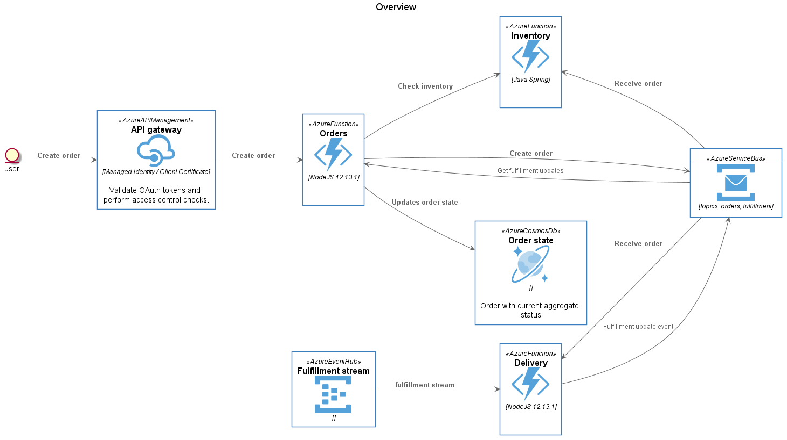

# Order Management Sample

This is a reference design for a basic order management system hosted in Linux containers running on [Azure App Service on Linux](https://docs.microsoft.com/en-us/azure/app-service/containers/quickstart-docker). This reference design is intended to highlight the following concepts:

* Application Performance Monitoring (APM) via Application Insights
* Workload scale options
* DevOps flows

The following diagram illustrates the basic data flow of this design:

## Azure Infrastructure Deployment

TBD

## Service Deployment

Details for each service can be found in their respective pages:

* [Inventory Service](services/inventory/inventory.md)
* [Order Service](services/orders/orders.md)
