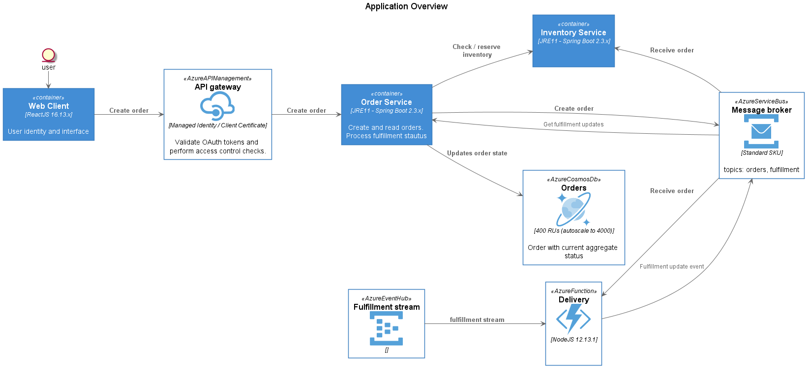

# Microservices Sample Application

This is a reference design for a basic order management system hosted in Linux containers. It can be deployed on either [Azure App Service on Linux](https://docs.microsoft.com/en-us/azure/app-service/containers/quickstart-docker) or any Kubernetes environemnt such as [Azure Kubernetes Service (AKS)](https://docs.microsoft.com/en-us/azure/aks/). Core services in this reference design are written in Spring Boot (Java 11) with the following concepts highlighted:

* Observability: Logging, performance monitoring, and distributed tracing
* JVM: metrics and tuning
* DevOps: Deployment and automation
* Service Abstraction: Dapr framework

The following diagram illustrates the basic data flow of this design:

## Infrastructure Deployment

Prior to testing this application, the following services must be deployed into an Azure subscription that you have administrative control over:

* Cosmos DB
* Service Bus
* API Management
* Azure Kubernetes Service
* Application Insights and Log Analytics
* Container Registry (or Docker Hub)

Instructions and deployment templates for these services can be found in the [Deployment](deployment/README.md) section of this repo.

## Service Configuration and Deployment

Details for each service can be found in their respective pages:

* [Inventory Service](services/inventory/README.md)
* [Order Service](services/orders/README.md)
